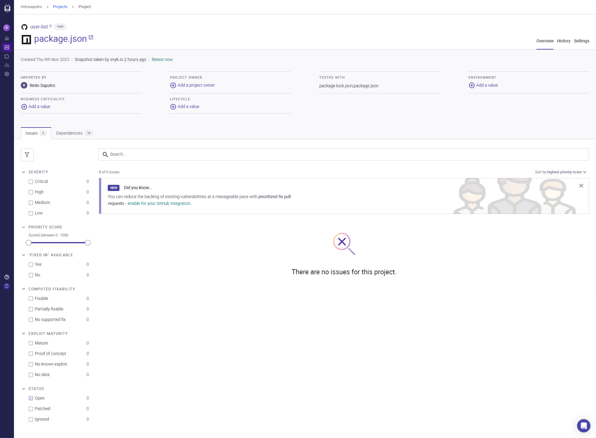
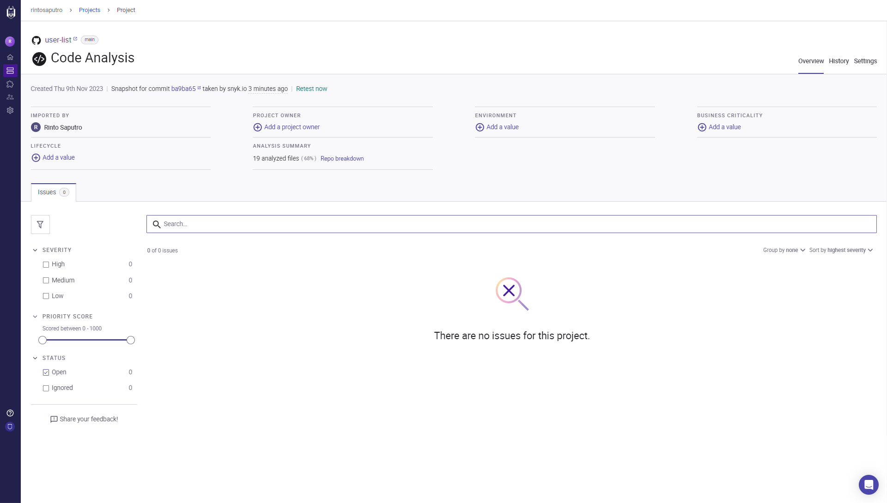

# User List App

User List is an application that displays a table of user data obtained from an API. It features ascending and descending sorting options for each field. Additionally, it includes two extra features: a search functionality based on user names and a tooltip for addresses. When hovering over the address field, it shows detailed information about that address.

## How to run

- Clone this repository

```
git clone https://github.com/rintosaputro/user-list.git
```

- Go to folder repository

```
cd user-list
```

- Install modules

```
npm install
```

- Run app

```
npm run dev
```

- If the browser does not open automatically then open the browser and go to http://localhost:5173
- Done

## Vulnerability Scan Results

1. Package
   

2. Code analysis
   
